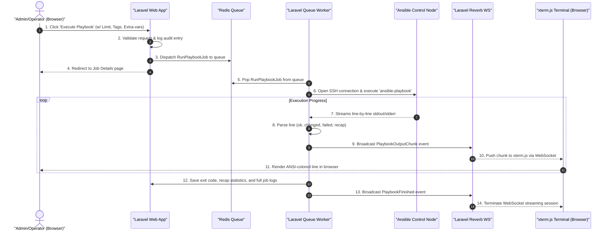

# CTRL — Ansible Control Dashboard User Guide & Manual

Welcome to **CTRL**, the web-based management dashboard for your Ansible infrastructure. This guide provides comprehensive, step-by-step instructions for administrators, operators, and viewers.

---

## Table of Contents
1. [System Overview & Architecture](#1-system-overview--architecture)
2. [User Management & Access Control (RBAC)](#2-user-management--access-control-rbac)
3. [First-Time Setup & SSH Configuration](#3-first-time-setup--ssh-configuration)
4. [The Dashboard Overview](#4-the-dashboard-overview)
5. [Playbook Runner & Live Executions](#5-playbook-runner--live-executions)
6. [Inventory Visualization, Ad-Hoc, & File Editing](#6-inventory-visualization-ad-hoc--file-editing)
7. [Interactive Browser SSH Terminal](#7-interactive-browser-ssh-terminal)
8. [Audit Logging & Job History](#8-audit-logging--job-history)
9. [Troubleshooting & FAQs](#9-troubleshooting--faqs)

---

## 1. System Overview & Architecture

CTRL acts as an orchestrator that sits between system administrators and your **Ansible Control Node**. Instead of logging into the command line to run playbooks and manage inventory, CTRL provides a visual, multi-tenant interface.

```mermaid
graph TD
    classDef browser fill:#2563eb,stroke:#3b82f6,stroke-width:2px,color:#fff
    classDef laravel fill:#ef4444,stroke:#f87171,stroke-width:2px,color:#fff
    classDef storage fill:#10b981,stroke:#34d399,stroke-width:2px,color:#fff
    classDef controlNode fill:#f59e0b,stroke:#fbbf24,stroke-width:2px,color:#fff

    subgraph UserInterface["Client Browser"]
        Client["Web UI (Blade + Alpine.js + xterm.js)"]:::browser
    end

    subgraph AppServer["Docker Host (CTRL Containers)"]
        Apache["ansible-ctrl-app (Apache + PHP 8.4)"]:::laravel
        Worker["ansible-ctrl-worker (Queue Worker)"]:::laravel
        Scheduler["ansible-ctrl-scheduler"]:::laravel
        Reverb["ansible-ctrl-reverb (WebSocket Server :8081)"]:::laravel
        
        DB[("ansible-ctrl-db (MariaDB 11.2)")]:::storage
        Redis[("ansible-ctrl-redis (Cache/Queue)")]:::storage
    end

    subgraph TargetInfra["Ansible Environment"]
        ControlNode["Ansible Control Node"]:::controlNode
        ManagedHosts["Target Managed Hosts"]:::controlNode
    end

    %% Connections
    Client -->|HTTP Requests (Port 8000)| Apache
    Client -->|WebSocket Connection (Port 8081)| Reverb

    Apache -->|Reads/Writes| DB
    Apache -->|Checks Cache| Redis
    Apache -->|Dispatches Jobs| Redis

    Worker -->|Pops Jobs| Redis
    Worker -->|Runs Ansible commands via SSH| ControlNode
    Worker -->|Streams output chunks via Event| Reverb
    
    Scheduler -->|Triggers cron playbooks| Redis

    ControlNode -->|Orchestrates tasks via SSH/WinRM| ManagedHosts
```

### Key Technical Aspects:
* **Asynchronous Runner**: Playbook runs are queued via Redis and executed in the background using isolated workers.
* **Real-time Streaming**: Standard output (stdout) and standard error (stderr) from Ansible runs are captured line-by-line and broadcasted via WebSockets (Laravel Reverb) to your browser terminal (powered by xterm.js).
* **Direct SSH Proxy**: Live terminal sessions and SFTP operations utilize `phpseclib3` to communicate securely with the Control Node.

---

## 2. User Management & Access Control (RBAC)

CTRL enforces Role-Based Access Control (RBAC) to ensure that users only perform operations appropriate to their privileges.

### User Roles

| Role | Permissions | Use Case |
|---|---|---|
| **Admin** | Full access to all settings, system configurations, ad-hoc execution, direct SSH terminal, full inventory editing, and logs. | Systems Architects, Infrastructure Owners |
| **Operator** | Can view playbooks, launch playbooks, view inventory topology, and use the SSH terminal (with command execution restrictions). Cannot change settings. | Operations Teams, Deployment Staff |
| **Viewer** | Read-only access. Can view the dashboard, check playbook histories, and see inventory layouts. Cannot run playbooks, execute ad-hoc commands, edit files, or open terminals. | Project Managers, QA, Auditors |

### Default Credentials
On database initialization, the default administrator account is seeded:
* **Email**: `admin@localhost`
* **Password**: `changeme`

> [!CAUTION]
> **Change the default administrator password immediately after your first login.** You can do this by navigating to **Settings** -> **Change Password**.

---

## 3. First-Time Setup & SSH Configuration

To enable CTRL to communicate with your Ansible Control Node, you must configure the SSH parameters.

### Step 1: Configure `.env` on Host
Make sure your `.env` contains the correct values for your Control Node. 

```env
# Ansible SSH Control Node
ANSIBLE_SSH_HOST=192.168.1.100      # IP address of the Control Node
ANSIBLE_SSH_PORT=22                 # SSH port (default: 22)
ANSIBLE_SSH_USER=ansible           # SSH username on the Control Node
ANSIBLE_SSH_KEY_PATH=/home/www-data/.ssh/ansible_rsa  # Path INSIDE the container
```

### Step 2: Establish the SSH Key
1. Copy your private SSH key (e.g. `id_rsa`) to the root of the project on the host, naming it `ansible_rsa`.
2. The Docker Compose file binds this file to `/home/www-data/.ssh/ansible_rsa` in the containers:
   ```yaml
   volumes:
     - ./ansible_rsa:/home/www-data/.ssh/ansible_rsa:ro
   ```
3. Make sure the file permissions on the host allow it to be read (typically `chmod 600 ansible_rsa`).

### Step 3: Test Connection
Once logged in as an Admin, navigate to **Settings**. Click the **Test SSH Connection** button.
* If successful, a green banner appears showing the target host, response latency, and detected Ansible version.
* If it fails, check the error message and verify that:
  1. The container can ping the Control Node IP.
  2. The public key corresponds to the private key and is in `/home/ansible/.ssh/authorized_keys` on the Control Node.
  3. The `ansible` user on the Control Node has appropriate file permissions.

---

## 4. The Dashboard Overview

The **Dashboard** is the home screen of CTRL and presents key statistics at a glance:
* **System Status Cards**: Shows the count of managed hosts, playbooks, total jobs executed, and active schedules.
* **SSH Status Badge**: A live indicator in the top navbar shows the connectivity status to the Ansible Control Node (Green = Connected, Red = Disconnected/No Credentials).
* **Job Execution Trends**: An interactive Chart.js line graph displaying your successful, changed, and failed jobs over the last 30 days.
* **Recent Job Activity**: A real-time updating feed displaying the latest playbook runs, who started them, when they ran, and their final status.

---

## 5. Playbook Runner & Live Executions

The **Playbook Runner** provides a visual frontend wrapper for the `ansible-playbook` command.

### How to Run a Playbook:
1. Go to **Playbooks** on the sidebar.
2. Select a playbook (`.yml` file) from the dropdown list. Playbooks are scanned automatically from the directory specified by `ANSIBLE_PLAYBOOKS_DIR` on your Control Node.
3. Configure optional arguments:
   * **Limit**: Restrict execution to specific host patterns (e.g., `webservers`, `db_host_01`).
   * **Tags**: Run only tasks tagged with specific names.
   * **Skip Tags**: Exclude tasks with specific tags.
   * **Extra Variables (JSON)**: Supply key-value parameters passed as `--extra-vars` (e.g. `{"version": "1.2.0", "env": "prod"}`).
   * **Check Mode (`--check`)**: Execute a dry-run to preview what changes would occur without modifying target systems.
   * **Verbosity**: Increase stdout detail (`-v`, `-vv`, `-vvv`, `-vvvv`).
4. Click **Execute Playbook**.

### Live Console Output:
Upon clicking execute, you will be redirected to the **Job View**. 
* The console terminal is powered by **xterm.js** and displays ANSI-colored stdout in real-time.
* You can watch the execution progress block-by-block.
* **Abort Option**: If a playbook behaves unexpectedly, Admins and Operators can click **Abort Job** to send a termination signal (`SIGINT`/`SIGTERM`) to the underlying Ansible process on the Control Node, stopping it immediately.

### Execution Sequence Workflow:



---

## 6. Inventory Visualization, Ad-Hoc, & File Editing

The **Inventory** tab provides three major utilities to inspect and edit your infrastructure.

### A. Topology Graph (D3.js)
* Visualizes your groups and host structures as an interactive, force-directed graph.
* Nodes represent hosts and groups. Edges show membership.
* Hovering over a host fetches its facts and metadata in real-time.

### B. Ad-Hoc Command Console
Run a quick, single task across host patterns without writing a full playbook:
1. Select a **Host Pattern** (e.g., `all` or `dbservers`).
2. Choose an **Ansible Module** (e.g., `ping`, `shell`, `service`, `apt`).
3. Provide **Module Arguments** (e.g., `name=nginx state=restarted` or `free -m`).
4. View the raw command line preview, execute, and view output.

### C. Built-in SFTP Text Editor
For Admins and authorised Operators, CTRL provides a built-in text editor to modify inventory files (`hosts.ini`, `hosts.yaml`) and playbooks directly on the Control Node:
1. Go to the **Editor** tab within the Inventory page.
2. Click **Load File** and supply the absolute path of the file on the Control Node.
3. Edit the file inside the text area.
4. Click **Save Changes** to upload the updated content securely via SFTP.

---

## 7. Interactive Browser SSH Terminal

For advanced operations, CTRL integrates an interactive web terminal:
* Provides direct terminal access to the Ansible Control Node.
* Powered by `xterm.js` and a background Laravel WebSocket worker.
* Fully interactive: supports tab completion, arrow keys, and interactive utilities (like `top` or `nano`).
* **Command Filter**: To secure the environment, non-admin users (Operators) are blocked from running destructive commands such as `rm -rf`, `mkfs`, or `dd` commands. All command inputs are processed and validated.

---

## 8. Audit Logging & Job History

Every action taken on the dashboard is audited for security compliance.

### Job History
* Records every playbook execution.
* Tracks: Job ID, Playbook Name, Triggered By (User), Duration, and Start/End times.
* Extracts the **PLAY RECAP** stats (`ok`, `changed`, `unreachable`, `failed`, `skipped`, `rescued`, `ignored`) so you can query which hosts succeeded or failed without scanning raw log files.

### Audit Log
* Every SSH command executed through the app (either via ad-hoc, terminal, or file editor) is logged.
* Records: Timestamp, User, Source IP, Command Type, Command String, Exit Code, and Execution Duration.
* Audit logs are read-only and cannot be cleared from the UI.

---

## 9. Troubleshooting & FAQs

### Q: The SSH connection status badge is red. What should I do?
* **A**: Go to the **Settings** page and click **Test SSH Connection** to see the detailed error message. Common issues include:
  * Incorrect `ANSIBLE_SSH_KEY_PATH` in `.env`.
  * Permissions of your SSH private key file on the host are too open. Ensure it is `600`.
  * The SSH public key has not been added to the `authorized_keys` file of the `ANSIBLE_SSH_USER` on the Control Node.

### Q: WebSockets are not connecting, and I see terminal/output loading spinners spinning forever.
* **A**: Ensure that the Reverb server is running and accessible:
  * Check that `ansible-ctrl-reverb` is running using `docker compose ps`.
  * Reverb runs on container port `8080`, which is mapped to host port `8081` in the default `docker-compose.yml`. Make sure host port `8081` is not blocked by firewall rules.
  * Verify that `REVERB_HOST` in `.env` matches your server's hostname or IP address.

### Q: Why does the inventory topology graph show as empty?
* **A**: The topology graph depends on a successful SSH connection to read your default inventory file. Ensure that the SSH status badge is green and that the file path defined in `ANSIBLE_INVENTORY_DEFAULT` exists on your Control Node.

### Q: I get database errors in the queue worker container logs.
* **A**: Check your `.env` configuration. Ensure `CACHE_STORE=redis` and `QUEUE_CONNECTION=redis` are configured correctly. Running cache clearing commands inside the app container can resolve configuration misalignment:
  ```bash
  docker compose exec app php artisan config:clear
  docker compose exec app php artisan cache:clear
  ```
