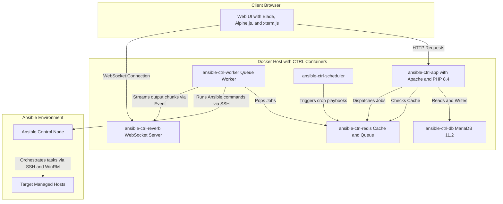
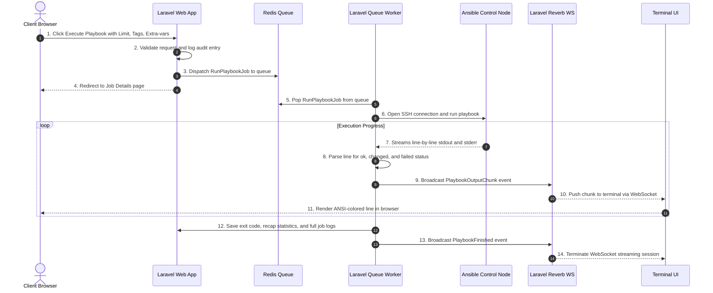
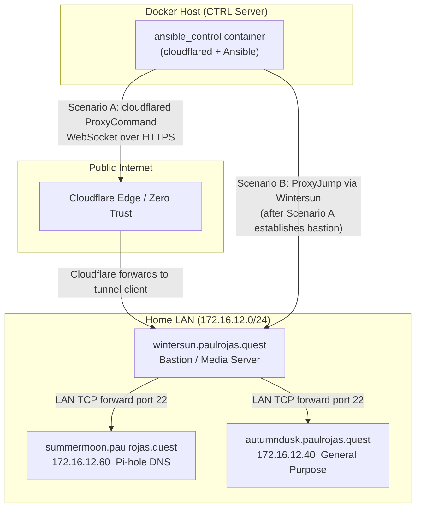

# CTRL — Ansible Control Dashboard User Guide & Manual

Welcome to **CTRL**, the web-based management dashboard for your Ansible infrastructure. This guide provides comprehensive, step-by-step instructions for administrators, operators, and viewers.

---

## Table of Contents
1. [System Overview & Architecture](#1-system-overview--architecture)
2. [User Management & Access Control (RBAC)](#2-user-management--access-control-rbac)
3. [First-Time Setup & SSH Configuration](#3-first-time-setup--ssh-configuration)
4. [The Dashboard Overview](#4-the-dashboard-overview)
5. [Playbook Runner & Live Executions](#5-playbook-runner--live-executions)
6. [Inventory Visualization, Ad-Hoc, & File Editing](#6-inventory-visualization-ad-hoc--file-editing)
7. [Interactive Browser SSH Terminal](#7-interactive-browser-ssh-terminal)
8. [Audit Logging & Job History](#8-audit-logging--job-history)
9. [Troubleshooting & FAQs](#9-troubleshooting--faqs)
10. [Security Architecture & Input Hardening](#10-security-architecture--input-hardening)
11. [Cloudflare Tunnel & Network Routing Architecture](#11-cloudflare-tunnel--network-routing-architecture)
12. [Connecting CTRL to Any Ansible Control Node](#12-connecting-ctrl-to-any-ansible-control-node)

---

## 1. System Overview & Architecture

CTRL acts as an orchestrator that sits between system administrators and your **Ansible Control Node**. Instead of logging into the command line to run playbooks and manage inventory, CTRL provides a visual, multi-tenant interface.



### Key Technical Aspects:
* **Asynchronous Runner**: Playbook runs are queued via Redis and executed in the background using isolated workers.
* **Real-time Streaming**: Standard output (stdout) and standard error (stderr) from Ansible runs are captured line-by-line and broadcasted via WebSockets (Laravel Reverb) to your browser terminal (powered by xterm.js).
* **Direct SSH Proxy**: Live terminal sessions and SFTP operations utilize `phpseclib3` to communicate securely with the Control Node.

---

## 2. User Management & Access Control (RBAC)

CTRL enforces Role-Based Access Control (RBAC) to ensure that users only perform operations appropriate to their privileges.

### User Roles

| Role | Permissions | Use Case |
|---|---|---|
| **Admin** | Full access to all settings, system configurations, ad-hoc execution, direct SSH terminal, full inventory editing, and logs. | Systems Architects, Infrastructure Owners |
| **Operator** | Can view playbooks, launch playbooks, view inventory topology, and use the SSH terminal (with command execution restrictions). Cannot change settings. | Operations Teams, Deployment Staff |
| **Viewer** | Read-only access. Can view the dashboard, check playbook histories, and see inventory layouts. Cannot run playbooks, execute ad-hoc commands, edit files, or open terminals. | Project Managers, QA, Auditors |

### User Management Panel (Admins Only)
Administrators can manage the platform's user base directly from the **Users** section on the sidebar. This includes:
* **User CRUD**: Registering new accounts, modifying existing profiles (name, email, role), and deleting users.
* **Optional Password Updates**: Modifying a user's password without requiring password changes during basic profile updates.
* **Inline Status Toggles**: Instantly activating/deactivating a user's account using an AJAX-based toggle in the list view.
* **Safety Lockouts**: To prevent accidental self-lockouts:
  - Administrators are blocked from deleting their own accounts.
  - Administrators are blocked from deactivating their own accounts.
  - Administrators are blocked from changing their own role (demoting themselves from Admin).
  - These restrictions are enforced at both the UI and controller levels.

### Default Credentials
On database initialization, the default administrator account is seeded:
* **Email**: `admin@localhost`
* **Password**: `changeme`

> [!CAUTION]
> **Change the default administrator password immediately after your first login.** You can do this by navigating to **Settings** -> **Change Password**.

---

## 3. First-Time Setup & SSH Configuration

> [!NOTE]
> CTRL connects directly to your Ansible Control Node over standard SSH. **No bastion, jump host, or VPN is required** as long as the control node is reachable from the machine running CTRL (same network, public IP, or cloud VM).

To point CTRL at your control node, follow these three steps:

### Step 1: Drop Your Private SSH Key into the Project Root

Name the file `ansible_rsa` and place it in the project root alongside `docker-compose.yml`:
```bash
# If you already have a key pair:
cp ~/.ssh/id_ed25519 ./ansible_rsa
chmod 600 ./ansible_rsa

# Or generate a fresh key pair dedicated to CTRL:
ssh-keygen -t ed25519 -C "ctrl-dashboard" -f ./ansible_rsa
# Then install the public key on the control node:
ssh-copy-id -i ./ansible_rsa.pub your_user@YOUR_CONTROL_NODE_IP
```
Docker Compose automatically mounts this file into all containers as `/home/www-data/.ssh/ansible_rsa` (already configured in `docker-compose.yml` — no changes needed).

### Step 2: Configure `.env`

Set the following values in your `.env` to point at your control node:
```env
# Where your Ansible control node lives
ANSIBLE_SSH_HOST=192.168.1.100        # IP address, hostname, or FQDN
ANSIBLE_SSH_PORT=22                   # SSH port (22 is the default)
ANSIBLE_SSH_USER=your_user            # SSH username on the control node
ANSIBLE_SSH_KEY_PATH=/home/www-data/.ssh/ansible_rsa  # Path inside the container (do not change)
ANSIBLE_SSH_PASSWORD=                 # Leave blank when using a key

# Paths on the control node
ANSIBLE_WORKING_DIR=/home/your_user/ansible
ANSIBLE_INVENTORY_DEFAULT=/home/your_user/ansible/inventory.ini
ANSIBLE_PLAYBOOKS_DIR=/home/your_user/ansible/playbooks
```

> [!TIP]
> After the initial setup, you can update the host, port, user, and path settings directly from the **Settings** page in the UI without touching `.env` or restarting containers. Only auth credentials (`KEY_PATH` / `PASSWORD`) require an `.env` edit and a `docker compose restart`.

### Step 3: Start Containers and Test the Connection
```bash
docker compose up -d
```
Then log into CTRL as Admin, navigate to **Settings**, and click **Test SSH Connection**.
* ✅ **Success** — a green panel shows the host, latency, and detected Ansible version.
* ❌ **Failure** — the error message will indicate the exact cause. Common fixes:
  1. Ensure the private key file is present and `chmod 600 ./ansible_rsa`.
  2. Confirm the public key is in `~/.ssh/authorized_keys` on the control node.
  3. Verify the control node is reachable: `docker compose exec app ping -c 3 YOUR_HOST`.

For advanced scenarios (cloud VMs, non-standard ports, bastion/jump hosts, Cloudflare tunnels), see **Section 12**.

---

## 4. The Dashboard Overview

The **Dashboard** is the home screen of CTRL and presents key statistics at a glance:
* **System Status Cards**: Shows the count of managed hosts, playbooks, total jobs executed, and active schedules.
* **SSH Status Badge**: A live indicator in the top navbar shows the connectivity status to the Ansible Control Node (Green = Connected, Red = Disconnected/No Credentials).
* **Job Execution Trends**: An interactive Chart.js line graph displaying your successful, changed, and failed jobs over the last 30 days.
* **Recent Job Activity**: A real-time updating feed displaying the latest playbook runs, who started them, when they ran, and their final status.

---

## 5. Playbook Runner & Live Executions

The **Playbook Runner** provides a visual frontend wrapper for the `ansible-playbook` command.

### How to Run a Playbook:
1. Go to **Playbooks** on the sidebar.
2. Select a playbook (`.yml` file) from the dropdown list. Playbooks are scanned automatically from the directory specified by `ANSIBLE_PLAYBOOKS_DIR` on your Control Node.
3. Configure optional arguments:
   * **Limit**: Restrict execution to specific host patterns (e.g., `webservers`, `db_host_01`).
   * **Tags**: Run only tasks tagged with specific names.
   * **Skip Tags**: Exclude tasks with specific tags.
   * **Extra Variables (JSON)**: Supply key-value parameters passed as `--extra-vars` (e.g. `{"version": "1.2.0", "env": "prod"}`).
   * **Check Mode (`--check`)**: Execute a dry-run to preview what changes would occur without modifying target systems.
   * **Verbosity**: Increase stdout detail (`-v`, `-vv`, `-vvv`, `-vvvv`).
4. Click **Execute Playbook**.

### Live Console Output:
Upon clicking execute, you will be redirected to the **Job View**. 
* The console terminal is powered by **xterm.js** and displays ANSI-colored stdout in real-time.
* You can watch the execution progress block-by-block.
* **Abort Option**: If a playbook behaves unexpectedly, Admins and Operators can click **Abort Job** to send a termination signal (`SIGINT`/`SIGTERM`) to the underlying Ansible process on the Control Node, stopping it immediately.

### Execution Sequence Workflow:



---

## 6. Inventory Visualization, Ad-Hoc, & File Editing

The **Inventory** tab provides three major utilities to inspect and edit your infrastructure.

### A. Topology Graph (D3.js)
* Visualizes your groups and host structures as an interactive, force-directed graph.
* Nodes represent hosts and groups. Edges show membership.
* Hovering over a host fetches its facts and metadata in real-time.

### B. Ad-Hoc Command Console
Run a quick, single task across host patterns without writing a full playbook:
1. Select a **Host Pattern** (e.g., `all` or `dbservers`).
2. Choose an **Ansible Module** (e.g., `ping`, `shell`, `service`, `apt`).
3. Provide **Module Arguments** (e.g., `name=nginx state=restarted` or `free -m`).
4. View the raw command line preview, execute, and view output.

### C. Built-in SFTP Text Editor
For Admins and authorised Operators, CTRL provides a built-in text editor to modify inventory files (`hosts.ini`, `hosts.yaml`) and playbooks directly on the Control Node:
1. Go to the **Editor** tab within the Inventory page.
2. Click **Load File** and supply the absolute path of the file on the Control Node.
3. Edit the file inside the text area.
4. Click **Save Changes** to upload the updated content securely via SFTP.

---

## 7. Interactive Browser SSH Terminal

For advanced operations, CTRL integrates an interactive web terminal:
* Provides direct terminal access to the Ansible Control Node.
* Powered by `xterm.js` and a background Laravel WebSocket worker.
* Fully interactive: supports tab completion, arrow keys, and interactive utilities (like `top` or `nano`).
* **Command Filter**: To secure the environment, non-admin users (Operators) are blocked from running destructive commands such as `rm -rf`, `mkfs`, or `dd` commands. All command inputs are processed and validated.

---

## 8. Audit Logging & Job History

Every action taken on the dashboard is audited for security compliance.

### Job History
* Records every playbook execution.
* Tracks: Job ID, Playbook Name, Triggered By (User), Duration, and Start/End times.
* Extracts the **PLAY RECAP** stats (`ok`, `changed`, `unreachable`, `failed`, `skipped`, `rescued`, `ignored`) so you can query which hosts succeeded or failed without scanning raw log files.

### Audit Log
* Every SSH command executed through the app (either via ad-hoc, terminal, or file editor) is logged.
* Records: Timestamp, User, Source IP, Command Type, Command String, Exit Code, and Execution Duration.
* Audit logs are read-only and cannot be cleared from the UI.

---

## 9. Troubleshooting & FAQs

### Q: The SSH connection status badge is red. What should I do?
* **A**: Go to the **Settings** page and click **Test SSH Connection** to see the detailed error message. Common issues include:
  * Incorrect `ANSIBLE_SSH_KEY_PATH` in `.env`.
  * Permissions of your SSH private key file on the host are too open. Ensure it is `600`.
  * The SSH public key has not been added to the `authorized_keys` file of the `ANSIBLE_SSH_USER` on the Control Node.

### Q: WebSockets are not connecting, and I see terminal/output loading spinners spinning forever.
* **A**: Ensure that the Reverb server is running and accessible:
  * Check that `ansible-ctrl-reverb` is running using `docker compose ps`.
  * Reverb runs on container port `8080`, which is mapped to host port `8081` in the default `docker-compose.yml`. Make sure host port `8081` is not blocked by firewall rules.
  * Verify that `REVERB_HOST` in `.env` matches your server's hostname or IP address.

### Q: Why does the inventory topology graph show as empty?
* **A**: The topology graph depends on a successful SSH connection to read your default inventory file. Ensure that the SSH status badge is green and that the file path defined in `ANSIBLE_INVENTORY_DEFAULT` exists on your Control Node.

### Q: I get database errors in the queue worker container logs.
* **A**: Check your `.env` configuration. Ensure `CACHE_STORE=redis` and `QUEUE_CONNECTION=redis` are configured correctly. Running cache clearing commands inside the app container can resolve configuration misalignment:
  ```bash
  docker compose exec app php artisan config:clear
  docker compose exec app php artisan cache:clear
  ```

### Q: Why does the facts modal display pretty printed JSON or organized tables?
* **A**: The facts retrieval modal has been updated to organize facts into a readable list of key system metrics (Uptime, CPU, RAM, OS, SSH/Ping) under a "Summary" tab, with the full raw data pretty-printed under a "Raw JSON" tab.

### Q: Why did the job details page throw a 500 error previously?
* **A**: If a playbook task returned a dictionary or list in its `msg` or error logs, the internal `AssessmentParser` failed due to type constraints (expecting a string haystack for `str_contains`). The parser has been patched to auto-encode non-string messages/errors to JSON strings, preventing exceptions.

### Q: CodeMirror editor was not loading properly, giving Alpine/CodeMirror compartment errors.
* **A**: The bundled CodeMirror script has been adjusted to execute as an IIFE export object, preventing global scope collisions and ensuring `new CodeMirror.Compartment()` correctly instantiates.

---

## 10. Security Architecture & Input Hardening

To ensure complete platform safety, CTRL applies strict security filters to all actions that interact with the Ansible Control Node:
1. **Shell Argument Escaping**: All dynamically interpolated parameters (e.g. inventory files, playbooks, hostnames, ad-hoc module arguments) are passed through PHP's `escapeshellarg()` function, neutralising special shell control characters (`;`, `&`, `|`, `` ` ``, `$`).
2. **Regex Validation**:
   - Hostnames and facts collection are constrained to `/^[a-zA-Z0-9\.\-_]+$/`.
   - Ping patterns are restricted to `/^[a-zA-Z0-9\.\-_:,\*\[\]]+$/`.
   - Any payload failing these regular expression validations is rejected with an `InvalidArgumentException` before shell execution.
3. **Directory Traversal Prevention**: SFTP operations validate paths against allowed workspace directories (`ANSIBLE_WORKING_DIR`, `ANSIBLE_PLAYBOOKS_DIR`, `ANSIBLE_INVENTORY_DEFAULT`) and explicitly block any paths containing directory traversal segments (`..`).
4. **Command Filters**: Direct terminal sessions block destructive command patterns (like `rm -rf /`, `mkfs`, etc.) for non-admin accounts to provide basic operational guardrails.

---

## 11. Cloudflare Tunnel & Network Routing Architecture

This section documents exactly how CTRL and Ansible reach the managed homelab nodes. None of the managed hosts expose raw SSH ports to the public internet. All connectivity is brokered through a **Cloudflare Zero Trust Tunnel** and an internal bastion server.

### 11.1 Why Cloudflare Tunnels?

Traditionally, reaching a home-lab server over the internet requires opening and forwarding a port on your router — which exposes a service to the open internet and creates a permanent attack surface.

With Cloudflare Tunnels (`cloudflared`), **no inbound firewall ports are opened at all**. Instead, each server initiates an *outbound* encrypted WebSocket connection to Cloudflare's edge. Cloudflare acts as the secure relay:
* All authentication is handled by **Cloudflare Access** (Zero Trust policies).
* Traffic never touches the raw internet as plain TCP.
* The public IP of the home router is never disclosed.

### 11.2 Infrastructure Topology

The homelab managed by CTRL consists of three physical machines and one Docker-hosted Ansible Control Node.

| Role | Hostname | LAN IP | Public Reach |
|---|---|---|---|
| **Ansible Control Node** | *(Docker container on host)* | — | Internal to Docker network |
| **Bastion / Media Server** | `wintersun.paulrojas.quest` | *(dynamic)* | **Yes** — via Cloudflare Tunnel |
| **Internal Node (DNS/Pi-hole)** | `summermoon.paulrojas.quest` | `172.16.12.60` | **No** — LAN only |
| **Internal Node (General)** | `autumndusk.paulrojas.quest` | `172.16.12.40` | **No** — LAN only |



### 11.3 The Two Routing Scenarios

The routing logic lives in `/ansible/ssh_config` inside the `ansible_control` container. This file is passed to every Ansible SSH session via `ansible.cfg`'s `ssh_args = ... -F /ansible/ssh_config ...`.

#### Scenario A — Reaching Wintersun (Public Bastion)

**Route:** `ansible_control` → `cloudflared` CLI → Cloudflare ZT Edge → `wintersun` sshd

The `Host wintersun.paulrojas.quest` stanza in `ssh_config` uses a `ProxyCommand`:
```
ProxyCommand cloudflared access ssh --hostname %h
```
Instead of opening a raw TCP socket to port 22, SSH forks the `cloudflared` process and pipes all traffic through its stdin/stdout. `cloudflared`:
1. Looks up the Cloudflare Access application registered for `wintersun.paulrojas.quest`.
2. Authenticates using the stored service token or SSH certificate inside the container.
3. Opens an authenticated WebSocket to Cloudflare's edge network.
4. Cloudflare's edge forwards the decrypted TCP stream to Wintersun's internal SSH daemon.

The result: **Ansible connects to Wintersun's port 22 without that port ever being exposed to the internet.**

#### Scenario B — Reaching LAN Nodes (Summermoon & Autumndusk)

**Route:** `ansible_control` → *(Scenario A)* → `wintersun` → LAN TCP → target node sshd

The `Host summermoon.paulrojas.quest` and `Host autumndusk.paulrojas.quest` stanzas use `ProxyJump`:
```
ProxyJump paul@wintersun.paulrojas.quest
HostName     172.16.12.60   # or 172.16.12.40
```
SSH will:
1. First establish a connection to Wintersun **using Scenario A** (via `cloudflared`).
2. Ask Wintersun's sshd to open a direct TCP stream to the target node's LAN IP on port 22 (this requires `AllowTcpForwarding yes` on Wintersun).
3. Negotiate the second SSH leg through that forwarded stream.

The `HostName` directive that pins each node to its **LAN IP** is critical — see Section 11.4 below.

#### Catch-All for Raw LAN IPs

Ansible sometimes uses the `ansible_host` IP directly (e.g., `172.16.12.60`) rather than the FQDN — particularly in `delegate_to` tasks or when gathered facts are re-used. A catch-all stanza handles this:
```
Host 172.16.12.60 172.16.12.40
    ProxyJump paul@wintersun.paulrojas.quest
```
This ensures even raw-IP connections route correctly through the bastion.

### 11.4 The DNS Loopback Problem (Critical)

Without the `HostName <LAN IP>` directive in the ssh_config stanzas for `summermoon` and `autumndusk`, Ansible would resolve their FQDNs via **public DNS**. Both hostnames (`*.paulrojas.quest`) resolve to a Cloudflare edge IP — not to the LAN machines directly.

This creates a loopback trap:
1. SSH tries to connect to the Cloudflare IP (thinking it's the target host).
2. Traffic loops back out to the internet *after* already jumping into the private network.
3. Cloudflare drops the unauthenticated reflection — connection fails.

Pinning `HostName` to the LAN IP forces SSH to make a direct private connection *once it's already inside the network via Wintersun*, completely bypassing public DNS.

### 11.5 How ansible.cfg Applies the Custom ssh_config

The `[ssh_connection]` section of `/ansible/ansible.cfg` injects the custom config file into every Ansible connection:

```ini
[ssh_connection]
ssh_args = -C -F /ansible/ssh_config -o ControlMaster=auto -o ControlPersist=60s -o StrictHostKeyChecking=no -o UserKnownHostsFile=/dev/null
```

| Flag | Purpose |
|---|---|
| `-C` | Enables SSH compression to reduce bandwidth across the tunnel |
| `-F /ansible/ssh_config` | **The critical flag** — forces SSH to use the custom proxy routing rules |
| `-o ControlMaster=auto` | Enables connection multiplexing (one master socket per host) |
| `-o ControlPersist=60s` | Keeps the master socket alive 60 seconds between tasks — dramatically reduces per-task overhead |
| `-o StrictHostKeyChecking=no` | Skips host key prompts (ephemeral container has no persistent known_hosts) |
| `-o UserKnownHostsFile=/dev/null` | Discards all known_hosts lookups to prevent stale fingerprint conflicts |

> [!IMPORTANT]
> If you run a playbook **without** the `-F /ansible/ssh_config` flag (e.g., by calling `ansible-playbook` directly from outside the container), all connections to `summermoon` and `autumndusk` will fail immediately, and connections to `wintersun` will fail unless `cloudflared` is also invoked manually.

### 11.6 Connection Multiplexing & Performance

The `ControlMaster=auto` + `ControlPersist=60s` settings mean that the first Ansible task to connect to a given host establishes a full SSH handshake (including the `cloudflared` WebSocket setup for Wintersun). All subsequent tasks within 60 seconds reuse the same underlying socket — reducing per-task latency from ~2–3 seconds to under 100ms.

**Side effect to be aware of:** If a host becomes unreachable *mid-playbook*, the stale ControlMaster socket can block reconnection for up to 60 seconds. To force a fresh connection:
```bash
# Inside the ansible_control container:
docker compose exec ansible_control bash
rm -f /tmp/ssh-*
```

### 11.7 The Ansible Inventory Group Hierarchy

The `/ansible/inventory.ini` file mirrors the physical topology:

```
all
└── homelab  (group of groups)
    ├── media_servers  → wintersun.paulrojas.quest
    └── internal_nodes → summermoon (172.16.12.60)
                       → autumndusk (172.16.12.40)
dns_servers → summermoon.paulrojas.quest  (also in internal_nodes)
aws         → (reserved, empty)
```

* Targeting `homelab` in a playbook hits all three physical machines.
* Targeting `internal_nodes` skips the bastion and only touches the Raspberry Pi nodes.
* Targeting `dns_servers` runs tasks only on the Pi-hole host.
* The `[aws]` group is intentionally empty and reserved for future cloud expansion.

### 11.8 Diagnostic Playbook & the Tunnel

The `investigate_host.yml` diagnostic playbook was specifically refactored to respect the tunnel architecture. An earlier version attempted a **direct TCP connection to port 22** (`ansible.builtin.wait_for` with `host: <fqdn>` and `port: 22`) — which Cloudflare's edge blocks by design.

The corrected version:
* Uses `ssh -F /ansible/ssh_config` for all connectivity tests, routing through the tunnel.
* Relies on `ProxyJump` via Wintersun for all LAN node reachability checks.
* Reports network-layer failures (e.g., `ip neigh` showing `FAILED` for `172.16.12.40`) as evidence that the target is physically offline, not that the tunnel is broken.

### 11.9 Troubleshooting the Cloudflare Tunnel

#### Q: Ansible tasks fail with "ssh: connect to host wintersun.paulrojas.quest port 22: Connection refused".
* **Cause**: The `cloudflared` binary is not running inside the `ansible_control` container, or the stored Cloudflare service token has expired.
* **Fix**: Exec into the container and re-authenticate:
  ```bash
  docker compose exec ansible_control cloudflared access login https://wintersun.paulrojas.quest
  ```

#### Q: LAN nodes (summermoon, autumndusk) are unreachable even though Wintersun is up.
* **Cause A**: `AllowTcpForwarding` is disabled on Wintersun's sshd. Run the `fix_bastion.yml` playbook to restore it.
* **Cause B**: The target node is physically powered off or disconnected from the home LAN (as was the case with `autumndusk.paulrojas.quest`). Physical access is required to restore it.
* **Cause C**: The `HostName` LAN IP in `ssh_config` is stale because the node's DHCP lease changed. Verify with `ip neigh` from Wintersun.

#### Q: Playbook hangs for 60+ seconds mid-run, then fails.
* **Cause**: A stale ControlMaster socket is blocking reconnection after a host became unreachable.
* **Fix**: Remove the stale socket files from inside the container:
  ```bash
  docker compose exec ansible_control rm -f /tmp/ssh-*
  ```

#### Q: The `investigate_host.yml` diagnostic playbook reported a timeout on Wintersun itself.
* **Cause**: An earlier version of the playbook used `wait_for: port=22` with the raw FQDN, bypassing the `cloudflared` ProxyCommand. Cloudflare blocks direct TCP/22 to its edge IPs by design.
* **Fix**: This has been corrected. The playbook now uses `ssh -F /ansible/ssh_config` for all reachability checks, correctly routing through the tunnel.

---

## 12. Connecting CTRL to Any Ansible Control Node

> [!IMPORTANT]
> **A bastion, jump host, or Cloudflare tunnel is NOT required.** CTRL connects directly to any Ansible control node over standard SSH. If the control node has an IP address or hostname your Docker host can reach and SSH is open on it, you can connect — nothing more is needed. Advanced routing scenarios (bastion, Cloudflare, etc.) are documented below only for cases where the control node is behind a private network with no direct route.

CTRL is not tied to any specific infrastructure. It can manage **any machine that has Ansible installed** and that is reachable via SSH from the Docker host running CTRL.

### 12.1 What Is a "Control Node" in This Context?

In Ansible terminology, the **control node** is the machine where `ansible` and `ansible-playbook` binaries are installed and where playbooks are executed from. It is *not* one of the machines being managed — it is the machine that *does the managing*.

CTRL acts as a web front-end to your control node. CTRL itself does **not** run Ansible directly; it SSHes into the control node and runs Ansible commands there on your behalf.

```
Your Browser → CTRL Web App → SSH → Ansible Control Node → SSH/WinRM → Managed Hosts
```

The control node can be anything SSH-accessible:
* A bare-metal server on your LAN
* A VM on your local machine (VirtualBox, Parallels, etc.)
* A Docker container on the same Docker host as CTRL
* A cloud VM (AWS EC2, GCP Compute, Azure VM)
* A VPS (DigitalOcean, Hetzner, Linode)
* *(Advanced)* A server behind a bastion / jump host
* *(Advanced)* A server behind a Cloudflare Zero Trust Tunnel

### 12.1.1 Which Scenario Applies to You?

Use this decision tree to go straight to the right section:

```
Is your control node reachable via a direct SSH connection
(same LAN, public IP, VPS, cloud VM, or VPN)?
│
├── YES  →  Use Scenario 1 (Section 12.3)  ← most common
│           Nothing extra needed. Just an IP/hostname, a user, and a key.
│
└── NO — it's behind a private network with no public port:
    │
    ├── Behind a jump host / bastion server?
    │   └── Use Scenario 4 (Section 12.6)
    │
    ├── Behind a Cloudflare Zero Trust Tunnel?
    │   └── Use Scenario 5 (Section 12.7)
    │
    └── Docker container on the same host as CTRL?
        └── Use Scenario 6 (Section 12.8)
```

### 12.2 Configuration Reference

All connection parameters are stored in your `.env` file and can also be edited live through the **Settings** page in the UI.

| `.env` Variable | Settings UI Field | Default | Description |
|---|---|---|---|
| `ANSIBLE_SSH_HOST` | Control Node Host | `127.0.0.1` | IP address or hostname of the control node |
| `ANSIBLE_SSH_PORT` | SSH Port | `22` | SSH port on the control node |
| `ANSIBLE_SSH_USER` | SSH User | `ansible` | Username to log in as |
| `ANSIBLE_SSH_KEY_PATH` | *(edit `.env` directly)* | — | Absolute path to the private key **inside** the CTRL container |
| `ANSIBLE_SSH_PASSWORD` | *(edit `.env` directly)* | — | Plaintext password (use keys instead whenever possible) |
| `ANSIBLE_WORKING_DIR` | Working Directory | `/etc/ansible` | Absolute path to Ansible's working directory on the control node |
| `ANSIBLE_INVENTORY_DEFAULT` | Default Inventory Path | `/etc/ansible/inventory` | Absolute path to the default inventory file on the control node |
| `ANSIBLE_PLAYBOOKS_DIR` | Playbooks Directory | `/etc/ansible/playbooks` | Directory scanned for `.yml` playbooks on the control node |
| `ANSIBLE_VAULT_PASSWORD_FILE` | *(edit `.env` directly)* | — | Path to an Ansible Vault password file on the control node |

> [!TIP]
> The Settings page at **Settings → SSH Connection** lets you update `ANSIBLE_SSH_HOST`, `ANSIBLE_SSH_PORT`, `ANSIBLE_SSH_USER`, `ANSIBLE_WORKING_DIR`, `ANSIBLE_INVENTORY_DEFAULT`, and `ANSIBLE_PLAYBOOKS_DIR` without editing `.env` manually. Auth credentials (`KEY_PATH` / `PASSWORD`) must still be set in `.env` for security reasons.

### 12.3 Scenario 1 — Direct SSH ⭐ (The Default — Start Here)

**This covers the vast majority of setups.** If your control node has an IP or hostname that the machine running CTRL can reach over the network, this is your scenario — no extra configuration needed beyond an SSH user and key.

**Applies to**: Raspberry Pi on your LAN, any Ubuntu/Debian/RHEL server, VPS (DigitalOcean, Hetzner, Linode), cloud VM (EC2, GCP, Azure) with a public IP, or any node reachable over WireGuard/Tailscale/OpenVPN.

**Step 1 — Generate an SSH key pair** (skip if you already have one):
```bash
ssh-keygen -t ed25519 -C "ctrl-dashboard" -f ./ansible_rsa
```
This creates `ansible_rsa` (private) and `ansible_rsa.pub` (public) in your project root.

**Step 2 — Install the public key on the control node**:
```bash
ssh-copy-id -i ./ansible_rsa.pub your_user@192.168.1.100
```

**Step 3 — Place the private key in the project root**:
```bash
cp ansible_rsa ./ansible_rsa     # already there if you generated it in the project root
chmod 600 ./ansible_rsa
```
Docker Compose mounts `./ansible_rsa` into the containers at `/home/www-data/.ssh/ansible_rsa`:
```yaml
# docker-compose.yml (already configured)
volumes:
  - ./ansible_rsa:/home/www-data/.ssh/ansible_rsa:ro
```

**Step 4 — Configure `.env`**:
```env
ANSIBLE_SSH_HOST=192.168.1.100
ANSIBLE_SSH_PORT=22
ANSIBLE_SSH_USER=your_user
ANSIBLE_SSH_KEY_PATH=/home/www-data/.ssh/ansible_rsa
ANSIBLE_SSH_PASSWORD=
ANSIBLE_WORKING_DIR=/home/your_user/ansible
ANSIBLE_INVENTORY_DEFAULT=/home/your_user/ansible/inventory.ini
ANSIBLE_PLAYBOOKS_DIR=/home/your_user/ansible/playbooks
```

**Step 5 — Restart containers and test**:
```bash
docker compose restart
```
Navigate to **Settings** and click **Test SSH Connection**. A successful result looks like:
```json
{
  "status": "ok",
  "host": "192.168.1.100",
  "latency_ms": 12,
  "ansible_version": "ansible [core 2.17.1]"
}
```

### 12.4 Scenario 2 — Password Authentication (Not Recommended)

If key-based auth is not available, CTRL supports password auth as a fallback.

```env
ANSIBLE_SSH_HOST=192.168.1.100
ANSIBLE_SSH_USER=your_user
ANSIBLE_SSH_KEY_PATH=           # leave blank
ANSIBLE_SSH_PASSWORD=your_password
```

> [!WARNING]
> Storing SSH passwords in `.env` is a security risk. Use key-based authentication in any environment that handles sensitive infrastructure. If you must use a password, ensure your `.env` file has permissions `600` and is never committed to version control.

### 12.5 Scenario 3 — Non-Standard SSH Port

Some control nodes run sshd on a custom port to reduce automated scan noise.

```env
ANSIBLE_SSH_HOST=my-server.example.com
ANSIBLE_SSH_PORT=2222
ANSIBLE_SSH_USER=ansible
ANSIBLE_SSH_KEY_PATH=/home/www-data/.ssh/ansible_rsa
```

No other changes are needed — `phpseclib3` (used by CTRL) honours the `ANSIBLE_SSH_PORT` setting directly.

### 12.6 Scenario 4 — *(Advanced)* Node Behind a Bastion / Jump Host

> [!NOTE]
> This scenario is only needed when your control node **has no direct SSH port reachable** from the machine running CTRL. If you can `ssh user@your-node` directly, use Scenario 1 instead.

If your control node lives on a private network and is only reachable via a jump host (bastion), the SSH connection must be proxied through the bastion.

**Architecture**:
```
CTRL App → SSH → Bastion (public IP) → SSH → Control Node (private LAN)
```

The cleanest approach is to configure an SSH `ProxyJump` inside the control node's `~/.ssh/config` on the CTRL Docker host, or to use a wrapper script. However, the most portable method is to configure a **ProxyJump via a custom ssh_config** mounted into the container:

**Step 1** — Create a custom `ssh_config` in your project root:
```
# ./ssh_config
Host bastion.example.com
    User jump_user
    IdentityFile ~/.ssh/ansible_rsa
    StrictHostKeyChecking no

Host control-node.internal
    HostName 10.0.1.50
    ProxyJump jump_user@bastion.example.com
    User ansible
    IdentityFile ~/.ssh/ansible_rsa
    StrictHostKeyChecking no
```

**Step 2** — Mount the file in `docker-compose.yml`:
```yaml
volumes:
  - ./ansible_rsa:/home/www-data/.ssh/ansible_rsa:ro
  - ./ssh_config:/home/www-data/.ssh/config:ro
```

**Step 3** — Set the host to the alias defined in your `ssh_config`:
```env
ANSIBLE_SSH_HOST=control-node.internal
ANSIBLE_SSH_PORT=22
ANSIBLE_SSH_USER=ansible
ANSIBLE_SSH_KEY_PATH=/home/www-data/.ssh/ansible_rsa
```

CTRL's `phpseclib3` SSH client and the underlying Ansible SSH connections will both use the mounted `~/.ssh/config`, honouring the `ProxyJump` rule transparently.

> [!IMPORTANT]
> The bastion's public key must be pre-trusted (or `StrictHostKeyChecking no` set, as above) since the Docker container has an ephemeral `known_hosts`. Ensure `AllowTcpForwarding yes` is set in the bastion's `/etc/ssh/sshd_config`.

### 12.7 Scenario 5 — *(Advanced)* Node Behind a Cloudflare Zero Trust Tunnel

> [!NOTE]
> This scenario is only needed when your control node is completely hidden from the internet and exposed exclusively through Cloudflare Zero Trust. For most deployments, Scenario 1 (direct SSH) is sufficient.

This is the architecture used by the reference homelab that ships with this project's documentation. Refer to **Section 11** for a full architectural walkthrough.

**Quick summary for adapting it to your own tunnel**:

1. Set up a Cloudflare Zero Trust SSH application for your control node hostname at [one.dash.cloudflare.com](https://one.dash.cloudflare.com).
2. Install `cloudflared` inside the `ansible_control` container (or your control node's own Docker image).
3. Authenticate once: `cloudflared access login https://your-control-node.example.com`.
4. Configure `/ansible/ssh_config` (on the control node) with:
   ```
   Host your-control-node.example.com
       ProxyCommand cloudflared access ssh --hostname %h
       User ansible
       IdentityFile ~/.ssh/id_ed25519
       StrictHostKeyChecking no
   ```
5. Set `ANSIBLE_SSH_HOST=your-control-node.example.com` in CTRL's `.env`.

CTRL's SSH connection to the control node goes through `phpseclib3`, which connects directly. The Cloudflare tunnel abstraction lives *on the control node* itself (between it and the Cloudflare edge), not between CTRL and the control node.

### 12.8 Scenario 6 — *(Advanced)* Docker Container as Control Node (Same Host)

> [!NOTE]
> Only needed when your Ansible control node is itself a Docker container on the same host. Otherwise use Scenario 1 with the machine's IP or hostname.

If your Ansible control node runs as a Docker container on the **same Docker host as CTRL**, you can connect over Docker's internal network without any real network routing.

**Step 1** — Ensure both containers are on the same Docker network. In `docker-compose.yml`:
```yaml
services:
  app:
    networks:
      - ctrl_net

  ansible_control:
    image: your-ansible-image
    networks:
      - ctrl_net
    container_name: ansible_control

networks:
  ctrl_net:
    driver: bridge
```

**Step 2** — Use the container name as the host:
```env
ANSIBLE_SSH_HOST=ansible_control     # Docker service/container name
ANSIBLE_SSH_PORT=22
ANSIBLE_SSH_USER=ansible
ANSIBLE_SSH_KEY_PATH=/home/www-data/.ssh/ansible_rsa
```

Docker's embedded DNS resolves the container name to its internal IP automatically.

### 12.9 Scenario 7 — Cloud VM (AWS EC2, GCP, Azure, Hetzner, DigitalOcean)

Cloud VMs are the simplest case after a plain LAN node — they are typically directly reachable via a public IP or DNS name.

```env
ANSIBLE_SSH_HOST=ec2-54-123-45-67.compute-1.amazonaws.com
ANSIBLE_SSH_PORT=22
ANSIBLE_SSH_USER=ubuntu           # or ec2-user, admin, centos, etc.
ANSIBLE_SSH_KEY_PATH=/home/www-data/.ssh/ansible_rsa
ANSIBLE_WORKING_DIR=/home/ubuntu/ansible
ANSIBLE_INVENTORY_DEFAULT=/home/ubuntu/ansible/inventory.ini
ANSIBLE_PLAYBOOKS_DIR=/home/ubuntu/ansible/playbooks
```

**Key considerations for cloud nodes**:
* Ensure the cloud provider's **Security Group / Firewall** allows inbound TCP port 22 from your CTRL server's public IP.
* AWS EC2 uses **key-pair authentication only** — no password. Download the `.pem` file and place it as `ansible_rsa` in the project root.
* For AWS, the `.pem` file format is PEM-encoded RSA. `phpseclib3` handles both RSA and Ed25519 natively.
* If your cloud VM uses a **non-default username** (e.g., `ubuntu`, `ec2-user`, `centos`), set `ANSIBLE_SSH_USER` accordingly.

### 12.10 Switching Between Multiple Control Nodes

CTRL supports **one active control node at a time**, but switching between environments is straightforward:

**Option A — Via the Settings UI** (no restart needed):
1. Navigate to **Settings → SSH Connection**.
2. Update the host, port, user, and path fields.
3. Click **Save Settings** — changes take effect immediately.
4. Click **Test SSH Connection** to verify.

**Option B — Via `.env` + container restart** (for auth credential changes):
```bash
# Edit .env with new credentials, then:
docker compose restart
```
A restart is required only when changing `ANSIBLE_SSH_KEY_PATH` or `ANSIBLE_SSH_PASSWORD`, since those are loaded at boot via the volume mount and `phpseclib3` initialization.

**Option C — Multiple CTRL instances** for truly separate, concurrent environments:
Deploy a second copy of the CTRL stack in a separate directory with its own `.env`, Docker network, and database. Each instance manages its own control node independently.

### 12.11 Verifying the Connection & Common Failures

After any configuration change, use **Settings → Test SSH Connection**. The response will indicate:

| Response | Meaning |
|---|---|
| `"status": "ok"` with `ansible_version` | Everything is working correctly |
| `Connection refused` | Wrong host/port, or sshd is not running on the target |
| `Authentication failed` | Wrong user, key not in `authorized_keys`, or incorrect key path |
| `No route to host` / `Network unreachable` | Network-layer problem — firewall, VPN not connected, wrong IP |
| `Host key verification failed` | Stale known_hosts entry — safe to ignore since `StrictHostKeyChecking=no` is set |
| `Permission denied (publickey)` | Key exists but was not correctly installed. Re-run `ssh-copy-id` |
| `ansible: command not found` | SSH works but Ansible is not installed on the control node |

**Quick diagnostic checklist**:
```bash
# 1. Can CTRL's Docker container reach the target host at all?
docker compose exec app ping -c 3 <ANSIBLE_SSH_HOST>

# 2. Is SSH port open?
docker compose exec app nc -zv <ANSIBLE_SSH_HOST> <ANSIBLE_SSH_PORT>

# 3. Does the key work from the host machine (outside Docker)?
ssh -i ./ansible_rsa -p <PORT> <USER>@<HOST> 'ansible --version'

# 4. Check that the key was mounted correctly inside the container:
docker compose exec app ls -la /home/www-data/.ssh/ansible_rsa
```
